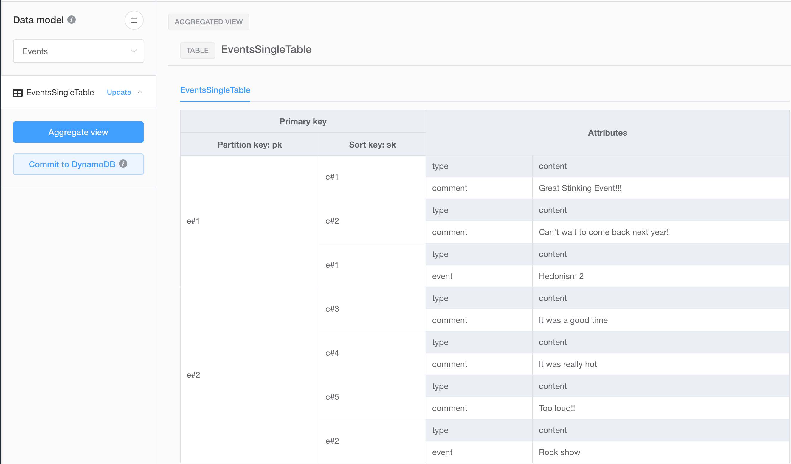

# Python ❤️ DynamoDB
Just a quick repo to play around with DynamoDB since it's been a while. 

## Inspiration
I'm a big fan of single table design, and I'm learning AppSync and GraphQL.
After watching this [video](https://www.youtube.com/watch?v=EOQqi6Yun7g), I decided I should try to write a custom resolver for appsync. Before I write some lambda code, I wanted to model out a scenario where I'd have multiple related entities in the same table. 

AppSync has an example Api named 'Event App' that uses multi-table design (entity tables), so I decided to adapt this same api to single-table-design. I used NoSQL Workbench to model the relationships.

